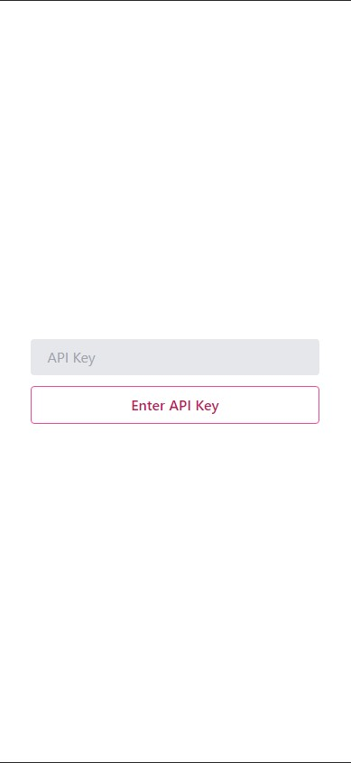
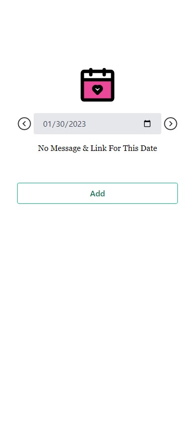
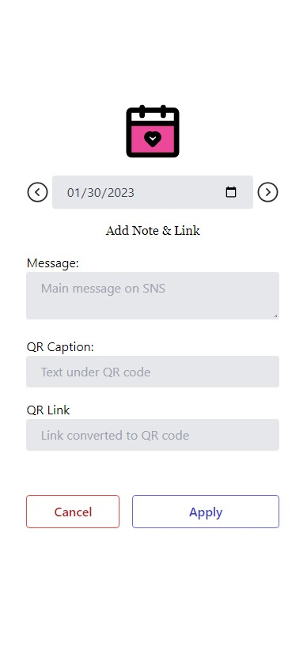

# Sweet Notes Screen App

**Note: This was a quick weekend project so more typical features used for larger codebases such as codestyles and CI-CD pipelines for deployments were skipped.**

Table of Contents

- [About This App](#about-this-app)
- [Deployment](#deployment)
- [Screenshots](#screenshots)

## About This App

This web app is the interface to the [DML API](https://github.com/adit-umakanth/dml-api), a serverless CRUD API that is used to set a daily message and link on the [Adafruit MagTag display](https://www.adafruit.com/product/4800).

The web app is made with [Svelte](https://svelte.dev/) + [Vite](https://vitejs.dev/) and uses [axios](https://axios-http.com/) to make HTTP requests to the API endpoint to view, edit, and delete message.

## Deployment

While this app is deployed online with [Firebase Hosting](https://firebase.google.com/products/hosting), it is meant only for a single user. The authentication is crude, and simply requires the API key for the DML API which it uses in the axios requests to view, edit, and delete the daily messages and links.

To use this app, the DML API must also be deployed and that API key can be used to interact with the app.

## Screenshots

